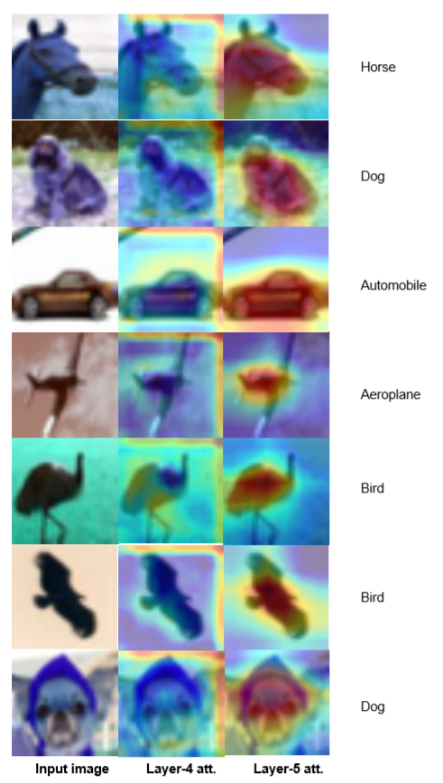

# Alexnet-with-Attention
Trained on CIFAR-10 and CIFAR-100 datasets 

This is a novel implementation of Alexnet, wherein we can visualize the part/area of the image which the network has focused on to determine the class of the image.

fig: An Illustration of the Attention regions on test images at different layer of Network.
